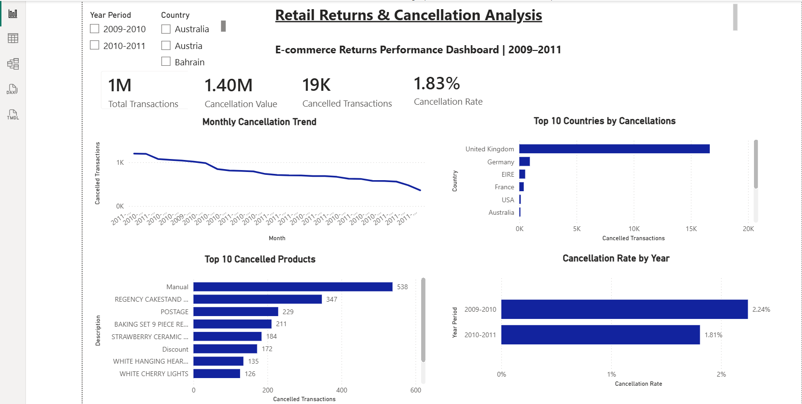

 Retail Returns & Reverse Logistics Optimization

Business Analysis case study focused on improving the retail returns and reverse logistics process for an e-commerce retailer.

## Dashboard Preview



 Project Overview

This project analyzes the retail returns lifecycle and proposes business and process improvements to reduce cancellation losses, improve return visibility, and optimize reverse logistics operations.

 Business Objectives

* Reduce cancellation rate.
* Improve return process visibility.
* Identify high-return products and countries.
* Support data-driven decision making.
* Recommend future-state process improvements.

 Key Deliverables

| Deliverable                 | Description                                        |
| --------------------------- | -------------------------------------------------- |
| Executive Summary           | Business overview and project summary              |
| BRD                         | Business Requirements Document                     |
| Stakeholder Analysis (RACI) | Roles and responsibilities                         |
| SQL Analysis                | Returns and cancellation analysis using SQL        |
| Excel Analysis              | KPI calculations and business insights             |
| Power BI Dashboard          | Interactive returns dashboard                      |
| AI Insights                 | AI-generated business insights and recommendations |
| Process Analysis            | As-Is and To-Be process analysis                   |
| Recommendations             | Business improvement recommendations               |
| Implementation Roadmap      | Phased implementation strategy                     |

 Tools Used

* SQL
* Microsoft Excel
* Power BI
* Microsoft Word
* AI-assisted Business Analysis

 Power BI Dashboard Highlights

* 1M Total Transactions
* 19K Cancelled Transactions
* 1.83% Cancellation Rate
* Monthly Cancellation Trend
* Top 10 Cancelled Products
* Top Countries by Cancellations
* Year-wise Cancellation Rate

Repository Structure

```
Retail-Returns-Reverse-Logistics
│
├── README.md
├── screenshots/
├── 00_Executive_Summary.pdf
├── 01_Business_Problem_Statement.pdf
├── 02_Stakeholder_Analysis_RACI.pdf
├── 03_BRD.pdf
├── 04_Excel_Analysis.xlsx
├── 05_SQL_Analysis.sql
├── 06_SQL_Findings.pdf
├── 07_PowerBI_Dashboard.pbix
├── 08_AI_Returns_Insights.pdf
├── 09_Process_Analysis.pdf
├── 10_Recommendations.pdf
└── 11_Implementation_Roadmap.pdf
```

 Skills Demonstrated

* Business Analysis
* Requirements Gathering
* Stakeholder Management
* SQL Data Analysis
* Excel Analytics
* Power BI Dashboarding
* Process Mapping
* Gap Analysis
* RACI Matrix
* Reverse Logistics Optimization
